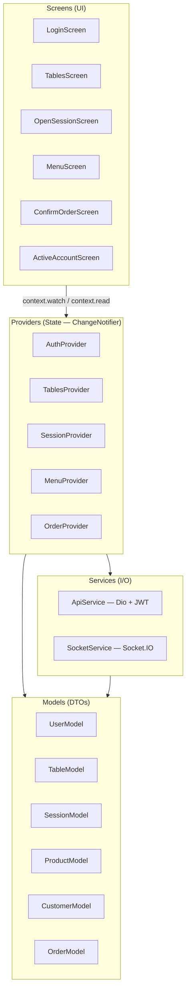

# Arquitetura — App Cliente (Flutter)

## Diagrama de camadas



## Responsabilidades por camada

### Screens
Exibição e interação com o usuário. Não fazem chamadas HTTP diretamente —
delegam toda a lógica a Providers via `context.read` / `context.watch`.
Usam `go_router` para navegação declarativa.

### Providers (`ChangeNotifier`)
Gerenciam o estado da aplicação. Chamam Services e expõem dados para as
Screens via `notifyListeners()`.

| Provider | Responsabilidade |
|----------|-----------------|
| `AuthProvider` | Token JWT, login/logout, role guard (GERENTE) |
| `TablesProvider` | Lista de mesas + subscrição WebSocket de sessões |
| `SessionProvider` | Sessão ativa, abrir/fechar, busca e criação de clientes |
| `MenuProvider` | Catálogo de produtos + carrinho local (quantity, notes) |
| `OrderProvider` | Pedidos da sessão + subscrição WebSocket de status de itens |

### Services (Singletons)

| Service | Responsabilidade |
|---------|-----------------|
| `ApiService` | Cliente HTTP (Dio) com interceptor JWT automático e base URL configurável |
| `SocketService` | Conexão WebSocket singleton — conecta uma vez, registra/desregistra listeners por tela |

### Models (DTOs)
Classes imutáveis com `fromJson()`. Sem lógica de negócio — apenas
mapeamento de dados da API para objetos Dart.

## Navegação

`go_router` com redirect guard: qualquer rota protegida redireciona para
`/login` se `AuthProvider.isLoggedIn == false`.

```
/login
/tables                              ← home após login
/tables/:tableId/open-session
/tables/:tableId/menu?sessionId=
/tables/:tableId/confirm?sessionId=
/tables/:tableId/account?sessionId=
```

## Fluxo de dados — exemplo: atualização de status de item

```
Gateway (WebSocket)
  └─► SocketService.on('order_item_status_changed')
        └─► OrderProvider.applyStatusChange(itemId, newStatus)
              └─► notifyListeners()
                    └─► ActiveAccountScreen reconstrói lista de itens
```
