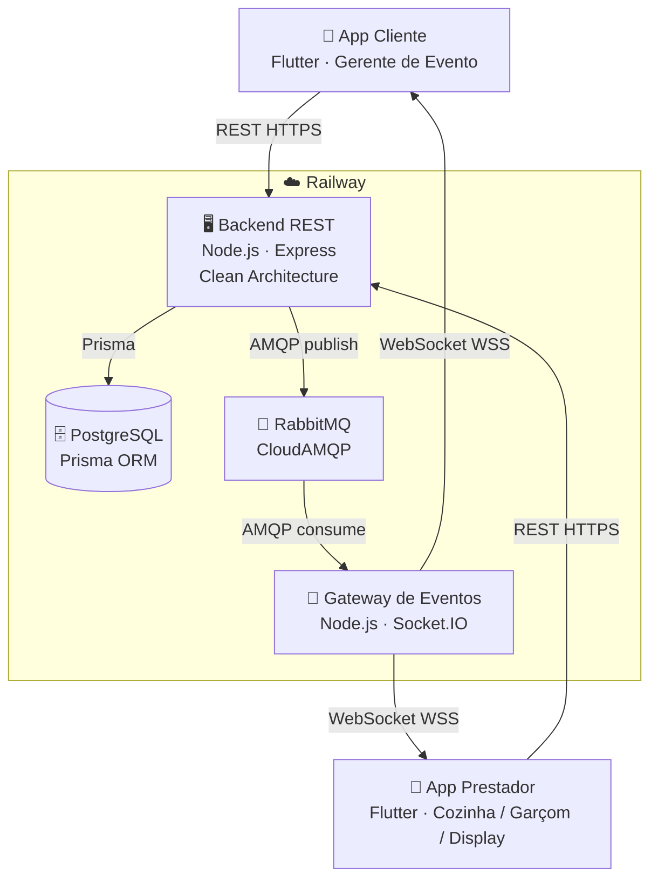
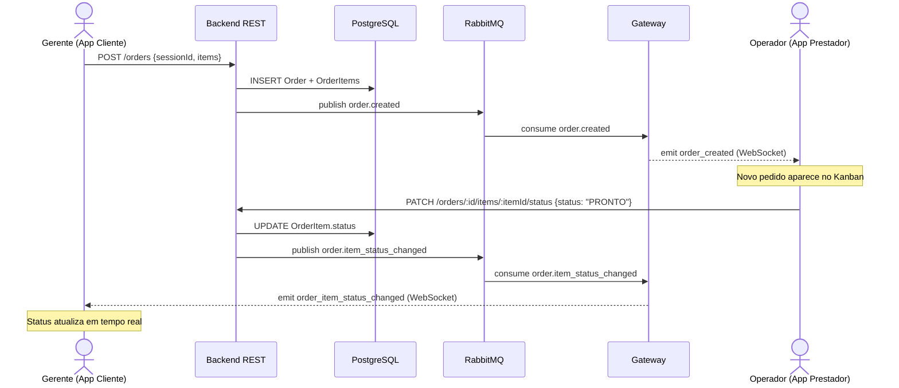

# Relatório Técnico Final — Sprint 4

**Projeto:** Greetup — Plataforma de Gestão de Hospitalidade Corporativa  
**Disciplina:** Lab. de Desenvolvimento de Aplicações Móveis e Distribuídas  
**Curso:** Engenharia de Software — 5º Período  
**Instituição:** Pontifícia Universidade Católica de Minas Gerais  
**Aluno:** Matheus Brasil Aguiar  
**Semestre:** 1º Semestre de 2026  

---

## 1. Introdução

O Greetup é uma plataforma SaaS de gestão de hospitalidade corporativa voltada para eventos e feiras B2B. O sistema digitaliza o fluxo operacional de estandes: abertura de mesas, registro de visitantes, pedidos de alimentos e bebidas, roteamento assíncrono para a cozinha e confirmação de entrega pelo garçom.

O domínio foi escolhido por possuir uma distinção clara entre dois perfis de usuário — o **Gerente de Evento (cliente)**, que abre mesas e realiza pedidos, e o **Operador de Serviço (prestador)**, subdividido em Cozinha (preparo) e Garçom (entrega) — tornando-o adequado ao modelo exigido pelo enunciado do projeto integrador.

Este relatório descreve a arquitetura implementada ao longo das quatro sprints, com foco especial na integração entre o aplicativo Flutter do prestador (entregue nesta sprint), o Middleware Orientado a Mensagens (MOM) e o aplicativo do cliente, demonstrando o fluxo completo de ponta a ponta.

---

## 2. Arquitetura do Sistema

### 2.1 Visão Geral

O sistema é composto por cinco componentes principais conectados por dois protocolos distintos: REST para operações síncronas e WebSocket/MOM para eventos assíncronos.



**Fluxo de evento completo:**



### 2.2 Backend REST — Clean Architecture

O backend foi implementado em **Node.js com Express**, seguindo os princípios de Clean Architecture. A estrutura de diretórios reflete a separação estrita entre as camadas:

```
backend/src/
  domain/entities/          — Entidades de domínio (User, Product, Order, etc.)
  domain/constants/         — Constantes de domínio (roles, categorias)
  application/usecases/     — Casos de uso (createOrder, updateItemStatus, etc.)
  application/ports/        — Interfaces dos repositórios (ports)
  infrastructure/
    database/               — Configuração do Prisma/PostgreSQL
    repositories/           — Implementações concretas dos ports
    messaging/              — RabbitMQPublisher
    security/               — HashService, TokenService (JWT)
    di/                     — Container de injeção de dependência manual
  interfaces/http/
    controllers/            — auth, orders, products, tables, customers
    middleware/             — auth.js, requireRole.js
    routes/                 — roteamento por recurso
```

Essa organização garante que as regras de negócio (casos de uso e entidades) sejam completamente independentes de frameworks e infraestrutura. A troca do banco de dados ou do MOM requer apenas a substituição da implementação concreta no container de DI, sem tocar nos casos de uso.

O schema de dados é gerenciado pelo **Prisma ORM** com PostgreSQL, incluindo suporte a **multi-tenancy**: cada entidade carrega um `companyId`, garantindo isolamento total de dados entre empresas distintas cadastradas na plataforma.

### 2.3 Middleware Orientado a Mensagens — RabbitMQ

O MOM adotado foi o **RabbitMQ**, hospedado no serviço gerenciado **CloudAMQP** (plano gratuito Lemur). A comunicação segue o padrão **Publish/Subscribe**: o backend publica eventos em exchanges e o Gateway os consome de filas vinculadas.

**Eventos implementados:**

| Evento | Produtor | Consumidor | Gatilho |
|---|---|---|---|
| `order.created` | Backend | Gateway → apps | Criação de pedido |
| `order.item_status_changed` | Backend | Gateway → apps | Mudança de status de item |
| `order.closed` | Backend | Gateway → apps | Fechamento de pedido |
| `table_session.opened` | Backend | Gateway → apps | Abertura de sessão |
| `table_session.closed` | Backend | Gateway → apps | Encerramento de sessão |

O payload do evento `order.item_status_changed`, por exemplo, carrega:

```json
{
  "orderId": "...",
  "sessionId": "...",
  "itemId": "...",
  "productId": "...",
  "productName": "Café Expresso",
  "productCategory": "BEBIDAS",
  "status": "PRONTO",
  "companyId": "...",
  "updatedAt": "2026-06-29T20:00:00.000Z"
}
```

### 2.4 Gateway de Eventos — WebSocket

Um serviço separado em Node.js atua como **Gateway de Eventos**: consome mensagens do RabbitMQ e as entrega em tempo real aos apps conectados via **Socket.IO**. Cada cliente se autentica com o JWT no handshake do WebSocket; o gateway verifica o token e associa o socket às salas `company:{companyId}` e `company:{companyId}:role:{role}`, garantindo que eventos só sejam entregues a usuários da mesma empresa e com o perfil adequado.

### 2.5 Aplicativos Flutter

Foram desenvolvidos dois aplicativos Flutter/Dart independentes:

**App Cliente (Gerente de Evento):**
- Tela de login
- Tela de mesas (lista de mesas abertas e criação de nova mesa)
- Tela de sessão ativa (lista de pedidos com status em tempo real)
- Tela de criação de pedido (cardápio com quantidades e observações por item)

**App Prestador (Operador de Serviço):**
- Tela de login (aceita apenas role `OPERADOR`)
- Tela da Cozinha — Kanban com 4 colunas (PENDENTE, EM_PREPARO, PRONTO, ENTREGUE), avança status por toque
- Tela do Garçom — lista de itens PRONTOS agrupados por mesa/cliente, confirmação de entrega
- Tela de Display — painel full-screen em modo paisagem para exibição em TV

Ambos os apps adotam o padrão **Provider** para gerenciamento de estado, com separação entre models, services, providers e screens — alinhada à Clean Architecture discutida em aula.

---

## 3. Decisões de Design

### 3.1 Separação Backend / Gateway

A decisão de separar o backend REST do Gateway de WebSocket foi motivada pelo princípio de **responsabilidade única**. O backend não conhece nenhum cliente conectado; ele apenas publica eventos no MOM. O Gateway não conhece regras de negócio; ele apenas roteia eventos para os clientes corretos. Essa separação permite escalar os dois serviços de forma independente e trocar o mecanismo de notificação (ex.: substituir WebSocket por push notifications) sem alterar o backend.

### 3.2 Multi-Tenancy no Backend

Desde a Sprint 2, todas as entidades do sistema carregam `companyId` como chave estrangeira. O JWT emitido no login carrega `companyId` no payload; o middleware de autenticação injeta esse valor em `req.user`, e todos os casos de uso filtram dados por `companyId`. Essa decisão possibilita que múltiplas empresas utilizem a mesma instância do sistema com total isolamento de dados — fundamento do modelo SaaS.

### 3.3 Roteamento por Role no GoRouter (App Prestador)

O GoRouter do app prestador utiliza `refreshListenable` apontando para o `AuthProvider`. Ao fazer login, o GoRouter detecta a mudança de estado e executa o redirect automaticamente com base em `operatorFunction` (COZINHA → `/cozinha`, GARCOM → `/garcom`, demais → `/display`). Isso elimina navegação imperativa no código de login e centraliza toda a lógica de roteamento no router.

### 3.4 Deploy em Nuvem

| Serviço | Plataforma | Justificativa |
|---|---|---|
| Backend REST | Railway | Deploy via Dockerfile, variáveis de ambiente por serviço, PostgreSQL gerenciado integrado |
| Gateway WebSocket | Railway | Mesmo projeto, isolamento de serviços |
| PostgreSQL | Railway (volume) | Gerenciado, backup automático |
| RabbitMQ | CloudAMQP | Plano gratuito suficiente para o volume do projeto; AMQP nativo |
| App web operador | Vercel | Deploy automático via GitHub, zero configuração para Next.js |
| App web admin | Vercel | Idem |

---

## 4. Dificuldades Encontradas e Soluções Adotadas

### 4.1 Prisma no Alpine Linux (Railway)

O Prisma requer `openssl` para gerar os binários do schema-engine, biblioteca não presente na imagem `node:18-alpine` por padrão. O erro manifestava-se como uma falha de JSON parse sem mensagem clara. A solução foi adicionar `RUN apk add --no-cache openssl` ao Dockerfile antes de `npx prisma generate`.

### 4.2 JWT_SECRET ausente no Gateway

O Gateway verificava tokens JWT no handshake do Socket.IO usando `process.env.JWT_SECRET`, mas a variável nunca foi configurada no serviço do Railway (apenas no backend). O resultado era que todos os handshakes falhavam silenciosamente: os sockets eram recusados, mas os apps não reportavam erro visível. O problema foi detectado ao perceber que o app do cliente nunca recebia eventos em tempo real. A solução foi adicionar `JWT_SECRET` nas variáveis do serviço gateway no Railway.

### 4.3 GoRouter Recriado a Cada Rebuild

O `buildRouter(auth)` era chamado dentro do método `build()` de um `StatelessWidget`, o que significava que um novo `GoRouter` era instanciado a cada `notifyListeners()` do `AuthProvider`. Com dois mecanismos de navegação em conflito (redirect do GoRouter e `context.go()` manual no LoginScreen), o app exibia "Application Not Found" após o login. A solução foi converter o widget para `StatefulWidget`, cacheando o router com `_router ??= buildRouter(auth)`, e delegar toda a navegação ao redirect automático do GoRouter via `refreshListenable`.

### 4.4 URL do Backend Alterada pelo Railway

O Railway regenerou automaticamente o domínio do serviço backend após uma alteração nas configurações de rede, resultando em URL diferente da configurada nos apps Flutter (via `--dart-define`) e nas variáveis do Vercel. A solução foi detectar a nova URL via painel do Railway, reconstruir os APKs com a URL correta e atualizar as variáveis de ambiente no Vercel.

---

## 5. Reflexão sobre os Padrões Estudados

### 5.1 Event-Driven Architecture (EDA)

A adoção de EDA foi o princípio central que guiou todas as decisões de integração. Em vez de o backend notificar diretamente os apps (acoplamento direto), ele publica eventos no RabbitMQ sem conhecer quem os consumirá. Isso implementa o padrão **Publish-Subscribe**, onde produtores e consumidores são completamente desacoplados. Na prática, isso permitiu adicionar o Gateway de WebSocket sem qualquer alteração no backend, e permitirá no futuro adicionar novos consumidores (ex.: notificações push, analytics) da mesma forma.

### 5.2 MOM — RabbitMQ

O RabbitMQ implementa o modelo **AMQP (Advanced Message Queuing Protocol)**, que oferece garantias de entrega, durabilidade de filas e roteamento flexível por exchanges. O uso de um MOM desacopla temporalmente os componentes: o backend pode publicar eventos mesmo que o Gateway esteja temporariamente fora do ar, pois as mensagens ficam enfileiradas até serem consumidas. Essa característica é especialmente relevante para sistemas distribuídos em nuvem, onde falhas parciais são esperadas.

### 5.3 Clean Architecture

A organização do backend em camadas independentes (entidades, casos de uso, ports, infraestrutura e interface HTTP) permitiu que mudanças significativas de infraestrutura (substituição do Redis por RabbitMQ, adição de multi-tenancy, deploy em nuvem) ocorressem sem impacto nas regras de negócio. A arquitetura limpa define que decisões de infraestrutura devem ser adiáveis; na prática, a troca do MOM exigiu apenas a criação de um novo `RabbitMQPublisher` implementando a interface `EventPublisher`, com uma única linha alterada no container de DI.

### 5.4 REST e Comunicação Síncrona

Os endpoints REST cumprem o papel de operações transacionais: criar pedidos, atualizar status, abrir sessões. A comunicação síncrona é usada onde a resposta imediata é necessária (ex.: o app precisa confirmar que o pedido foi criado com sucesso). A comunicação assíncrona via MOM é usada para notificações de estado, onde a latência de entrega é aceitável. Essa complementaridade entre REST síncrono e MOM assíncrono é um padrão consolidado em arquiteturas de microsserviços.

---

## 6. Conclusão

O Greetup demonstra a viabilidade de construir uma plataforma distribuída real com as tecnologias estudadas na disciplina. O sistema foi efetivamente utilizado em um evento real (feirinha de comidas), onde processou pedidos em tempo real sem apresentar falhas. Os desafios encontrados — desde configuração de infraestrutura até bugs de roteamento no Flutter — contribuíram para uma compreensão prática dos problemas que surgem em sistemas distribuídos reais, que nenhuma bibliografia isolada consegue transmitir completamente.

As decisões arquiteturais tomadas ao longo das quatro sprints demonstraram consistência com os princípios de EDA, Clean Architecture e comunicação assíncrona via MOM, confirmando a adequação dessas abordagens para sistemas com múltiplos atores, comunicação em tempo real e requisitos de escalabilidade.

